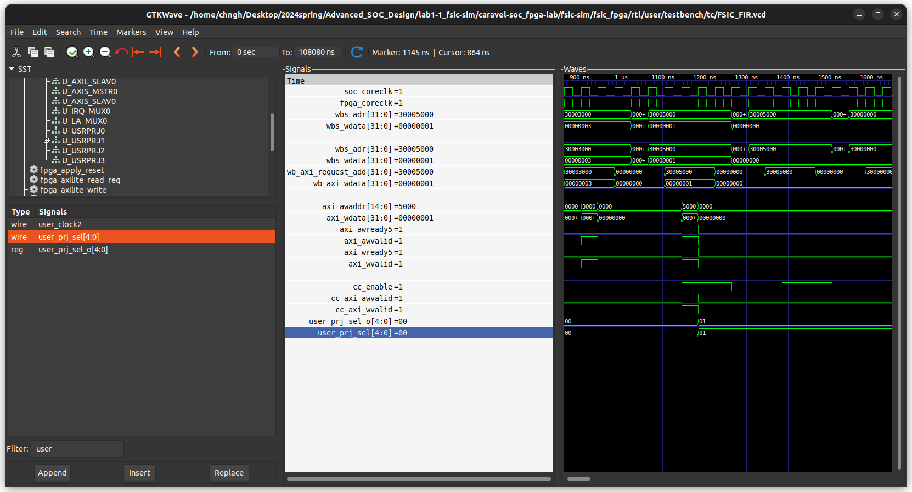

# LAB1-1_FSIC-SIM

###### EECS24 109020014 李承澔

## 1. Show the code that you use to program configuration address [‘h3000_5000]

```verilog
task soc_cc_cfg_write;
input [11:0] offset;		//4K range
input [3:0] sel;
input [31:0] data;
begin
	@ (posedge soc_coreclk);
	wbs_adr <= 32'h30005000;
	wbs_adr[11:2] <= offset[11:2];	//only provide DW address 
	wbs_wdata <= data;
	wbs_sel <= sel;
	wbs_cyc <= 1'b1;
	wbs_stb <= 1'b1;
	wbs_we <= 1'b1;
	@(posedge soc_coreclk);
	while(wbs_ack==0) begin
		@(posedge soc_coreclk);
	end
	$display($time, "=> soc_up_cfg_write : wbs_adr=%x, wbs_sel=%b, wbs_wdata=%x", wbs_adr, wbs_sel, wbs_wdata); 
end
endtask

// In test task
cfg_read_data_expect_value = 32'h1;
soc_cc_cfg_write(0, 4'b1111, cfg_read_data_expect_value);
```

## 2. Why by programming configuration address [‘h3000_5000], signal user_prj_sel[4:0]

In  `config_ctrl.v, there're 2 important variables to filter configuration address: ``cc_axi_awvalid ``and ``cc_axi_wvalid``with following assignment:

```verilog
assign cc_axi_awvalid = axi_awvalid && cc_enable;
assign cc_axi_wvalid = axi_wvalid && cc_enable;
```

where ``cc_enable``has assignment:

```verilog
cc_enable <= ( m_axi_request_add[31:12] == 20'h30005 )? 1'b1 : 1'b0;
```

Only when programming address has value ``20'h3005``at bit-range [31:12], the ``cc_enable``is set to true, and ``cc_axi_awvalid ``and ``cc_axi_wvalid``have values depending on ``axi_awvalid``and ``axi_wvalid.``

Later, ``config_ctrl.v`` checks whether the programming address value at bit-range[11:0] is ``12'h000``as following:

```verilog
always @ ( posedge axi_clk or negedge axi_reset_n ) 
begin
	if ( !axi_reset_n ) begin
		user_prj_sel_o <= 5'b0;
	end else begin
		if ( cc_axi_awvalid && cc_axi_wvalid ) begin
			if (axi_awaddr[11:0] == 12'h000 && (axi_wstrb[0] == 1) ) //offset 0
				user_prj_sel_o <= axi_wdata[4:0];
			else
				user_prj_sel_o <= user_prj_sel_o;
		end
	end
end
```

If address if correct, the user project selection would be written to ``user_prj_sel_o``and to ``user_prj_sel``.

# 3. FIR initialization (tap parameter, length) from SOC side (Test#1)

I use ``soc_up_cfg_write``and ``soc_up_cfg_read``functions to do initializations.

First call ``soc_up_cfg_write``function to write data length to address ``UP_BASE+12'h10``, and read that address again using ``soc_up_cfg_read``to check whether value had been written correctly.

Later I use a for loop to do writing and reading iteratively on tap parameters.

# 4. FIR initialization (tap parameter, length) from FPGA side(Test#2)

Similar to above method, I use ``fpga_axilite_write ``and ``fpga_axilite_read_req`` functions to do initializations.

First call ``fpga_axilite_write``function to write data length to address ``UP_BASE+12'h10``, and read that address again using `fpga_axilite_read_req` and wait for ``soc_to_fpga_axilite_read_cpl_event``to check whether value had been written correctly.

Later I use a for loop to do writing and reading iteratively on tap parameters.

# 5. How you feed in X data from FPGA side

I rewrote ``fpga_axis_req``function as ``fpga_axis_req_fir``to stream X data from FPGA side. It works similarly to the work in ``test002.``

# 6.how you get output Y data in testbench, and how to do comparison with golden values.

Since there's a block gets axis upstream continuously, it always captures the stream into ``soc_to_fpga_axis_captured``array, where should contain data length of output Y data. I have only to check the ``soc_to_fpga_axis_captured``array after FIR finished.

Therefore, I loaded golden data into ``soc_to_fpga_axis_expect_value``array first, and compare golden data in ``soc_to_fpga_axis_expect_value``array with output Y data in `soc_to_fpga_axis_captured` array using for loop.

# 7. Screenshotsimulation results printed on screen


# 8. Screenshot simulation waveform

* Configuration cycle

  
* AXI-Lite transaction cycles

  
* Stream-in

  
* Stream-out

  
